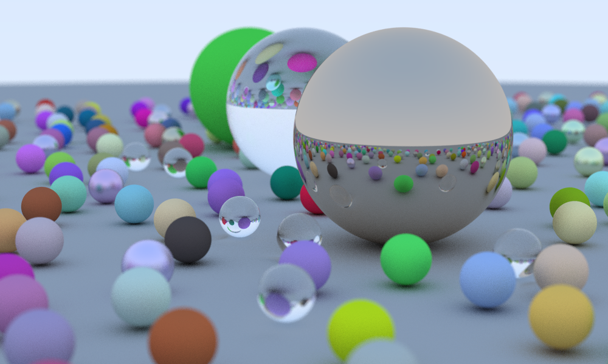

Raytracer in Rust
=================


A small raytracer in rust built while reading Peter Shirley's [*Ray Tracing in One Weekend*](https://github.com/RayTracing/InOneWeekend).  



The structure of the code is pretty much the same as in the book, except that I tried to replace 
the C-like returns through references and booleans by making use of the elegant Option type in 
Rust.


## Tests 

Tests can be run with 

```bash
$ cargo test
```

This also includes the doc-tests. 

## Documentation 

The source code documentation can be build and viewed by running 

```bash 
$ cargo doc --no-deps --open
```

## Examples 

To run the example, type

```
$ cargo run --example raytracing --release
```
